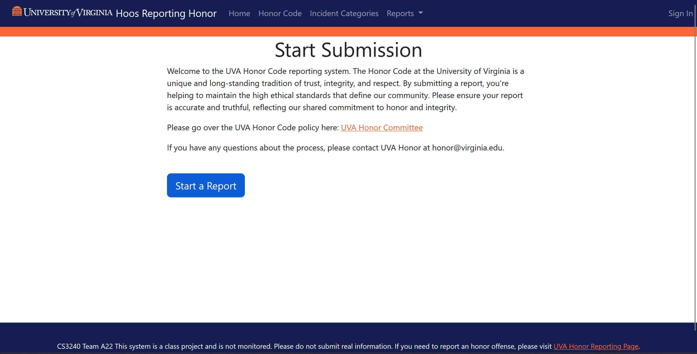
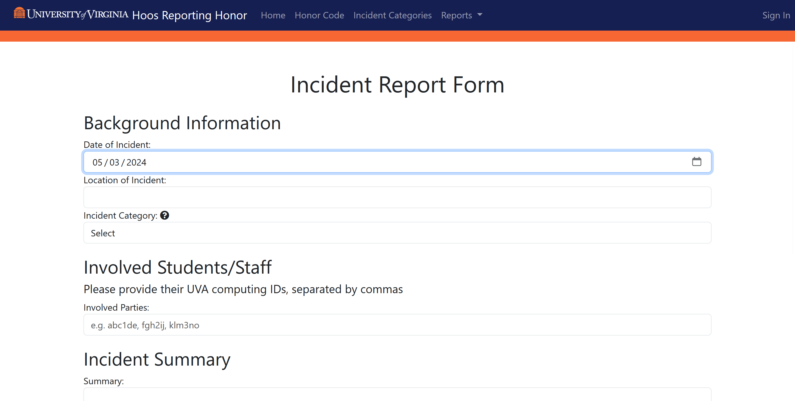
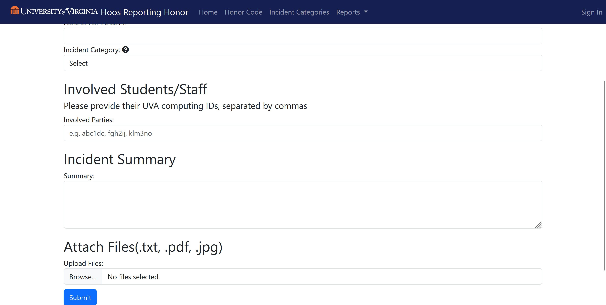
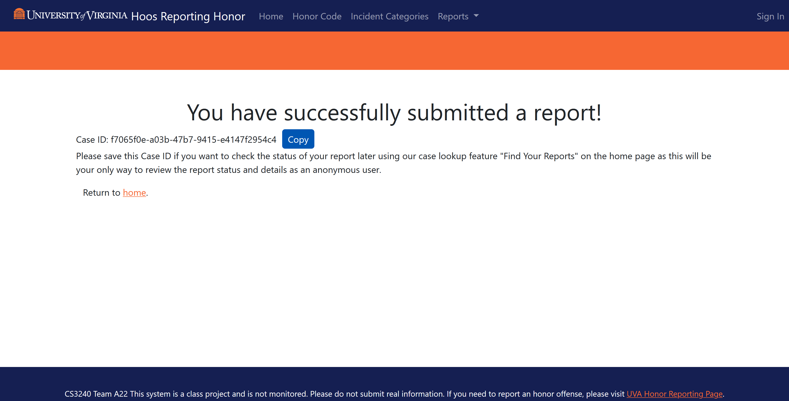
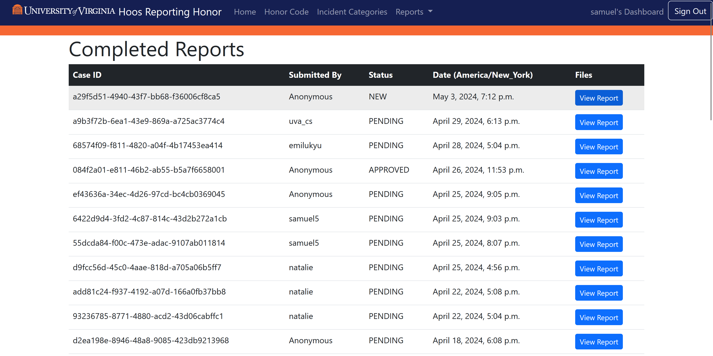
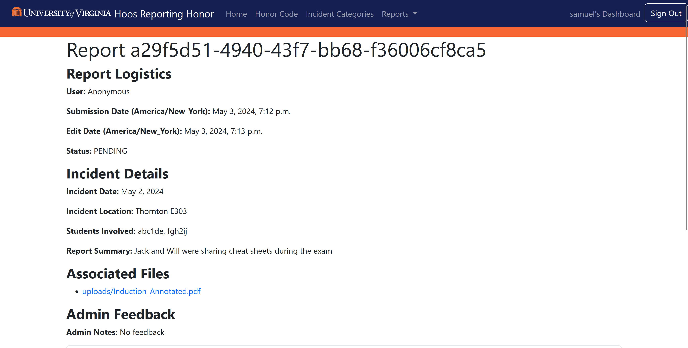
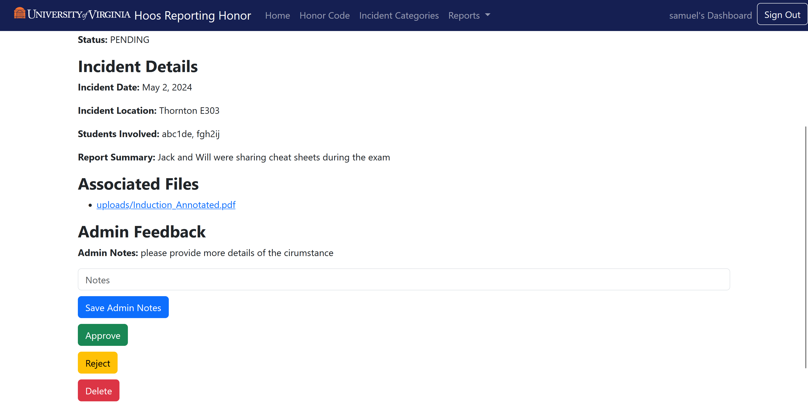

# Hoos Reporting Honor

**Description:** This project is a whistleblowing web app that is tailored to the purpose of reporting incidents of violation of [UVA's Honor Code](https://honor.virginia.edu/about/about-honor-committee). This project was made to adhere to the requirements of the CS3240 Spring 2024 class project.

## Table of Contents
- [Usage](#usage)
- [Tech Stack](#tech-stack)
- [Contributions](#contributions)
- [License](#license)
- [Web App View](#web-app-view)

## Usage

**General Usage:** This project can be used by students or any bystander who witnesses an honor violation to report it as a common user or anonymously. This honor reporting system is designed spcifically for UVA and to report to the [Honor Committee](https://honor.virginia.edu/about/about-honor-committee) to evaluate the reports as site admin.

**Reporting a Violation:** Navigate to our site: https://hoos-reporting-honor-951b7144d00a.herokuapp.com/home/ and you will be greeted by our home page. From here you may press the sign in button and login with google to create an account and make a report associated with your account that can be viewed later from your account's dashboard. You can also anaonymously create a report and copy your case ID shown after submission to use our case ID lookup system feature that allows anonymous and non-logged in users to easily view the status and details of their filed reports.

## Tech Stack

#### Frameworks

- **Django:** MVT framework that comes with a lot of out of the box functionality, which was useful for creating our app in the timespan of a semester while allowing our team to focus on features and UX instead of implementation details. (https://www.djangoproject.com/)

#### Libraries

- **Bootstrap:** Styling library that allows rapid development with many out of the box templates/buttons and containers for layout. Specifically in our project, we used django-bootstrap-v5, a third party library that adapts Bootstrap for Django's templates and has more integrated features and classes for Django's forms. (https://django-bootstrap-v5.readthedocs.io/en/latest/)

- **AllAuth:** Django library that is used to implement authentication featrures and social accounts. In our project specifically, we used django-allauth to configure our Google Login capabilities. (https://allauth.org/) 

- **Boto3:** AWS SDK for Python that is used for configuring Amazon S3 Bucket with low level access to AWS services. (https://boto3.amazonaws.com/v1/documentation/api/latest/index.html) 

## Contributions
* **John Defranco (qbk3xy)**

* **Henry Gao (djx3rn)** 

* **Samuel Glasscock (DevOps)**
    * Configured Heroku for hosting project and PostGreSQL database
    * Utilized AllAuth library and Google Developer Console for setting up Google Login capabilities
    * Configured AWS S3 bucket for storing project static files and files uploaded as supporting documents for reports

* **Natalie Yee (nvn5yn)** 

* **Emily Zhou (csz6wd)**

## License
If we were to release this project under a license, it would be MIT License and we would include the full text of the MIT license in a LICENSE.txt file in our project

## Web App View
Since this app is no longer live, these are provided views/flow from the site.

